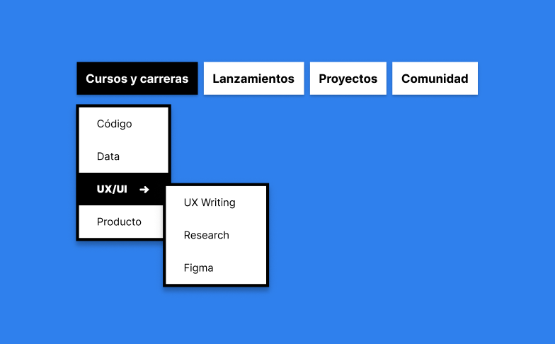
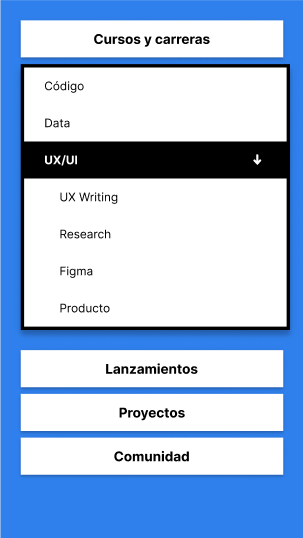

# DROP DOWN MENU

Drop Down Menu is a menu with different sublevels.




This project was extracted from [LeonidasEsteban.com](https://leonidasesteban.com/)
</br>
</br>

## Before starting!

### Requirements

- Node
- Npm
- React & React DOM

### Get started

- Clone the repository
- Install packages
  ```
  npm install
  ```
- Once the packages are installed, run the app
  ```
  npm start
  ```
- Open your browser at http://localhost:3000
